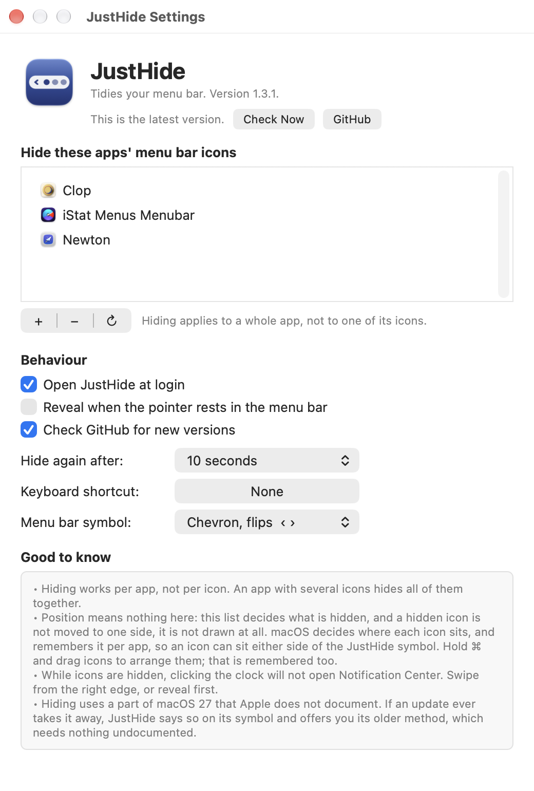

<div align="center">


# JustHide

**A small menu bar tidier for macOS 27.**

Pick the apps whose icons you don't need all the time. They disappear.
Click the chevron to bring them back.


</div>

---

## Why this exists

macOS 27 rebuilt the menu bar, and it broke the trick every menu bar utility relied
on. Items are no longer separate windows, so nothing can enumerate them the old way,
and inflating a spacer to shove icons off the edge no longer works the way it used to.

JustHide doesn't fight that. It uses the concealment facility macOS 27 has built in, so
hiding is instant, nothing slides around, and the menu bar's layout is never touched.

It does one job. There is no floating bar, no icon previews, no groups, no profiles.

## Requirements

- macOS 27 (Golden Gate) or later
- No permissions. Not Screen Recording, not Accessibility.[^ax]

[^ax]: Accessibility is used for exactly one optional nicety — listing which apps
currently have menu bar icons, so the **+** menu can show them. Skip it and you can
still add any app with **Other App…**.

## Install

There are no notarised releases, so build it. It takes a few seconds and needs only
Xcode's command line tools.

```sh
git clone https://github.com/benjustjammin/justhide.git
cd justhide
./build.sh
cp -R build/JustHide.app /Applications/
open -a JustHide
```

That's it. A chevron appears at the right of your menu bar.

> **Rebuilding?** `build.sh` ad-hoc signs by default. If you'd rather macOS stopped
> re-asking about anything after each rebuild, make a self-signed certificate called
> `JustHide Dev` in Keychain Access (Certificate Assistant → Create a Certificate →
> Self Signed Root, Code Signing) and the script picks it up automatically.

## Using it

- **Click the chevron** to show your hidden icons, click again to put them away.
- **Right-click it** for Settings and Quit.
- Set a **keyboard shortcut** in Settings if you'd rather not aim at the menu bar.
- Icons hide themselves again after a delay you choose, and never while your pointer
  is up in the menu bar.

In Settings, **+** lists the apps that have icons in your menu bar right now, so
adding one is a single click. **Other App…** covers anything that isn't running.

## Good to know

Honest list of the things that will surprise you, all of them consequences of how
macOS 27 works rather than choices:

- **Hiding is per app, not per icon.** An app with several icons hides all of them
  together.
- **While icons are hidden, clicking the clock won't open Notification Center.**
  Swipe in from the right edge, or reveal first. Wi-Fi and Control Centre are
  unaffected.
- **Flipping symbols point the wrong way on a second display.** macOS redraws a
  status item one change late on a mirrored bar, so a chevron that flips direction
  will be backwards over there. The fixed symbols avoid it entirely, and Settings
  tells you which family you've picked.
- **This uses part of macOS that Apple doesn't document.** If an update breaks it,
  JustHide says so in its log rather than failing quietly, and the older
  layout-based method is still there: `JustHide --width`.

## How it works

macOS 27 has an allowlist-based concealment facility — the one behind exam
"assessment mode". JustHide holds an assertion naming every running app *except* the
ones you've hidden, and macOS conceals the rest. Dropping the assertion reveals them.

Because it's an allowlist rather than a layout trick, there's no spacer item taking
up room, no icons sliding across the bar, and nothing to calibrate per display.

The private surface it touches is small and loaded defensively — every class and
selector is checked before use, and it reports itself unavailable rather than
crashing if a future macOS moves things:

```
/System/Library/PrivateFrameworks/MenuBarClientCore.framework
  MBAssessmentModeConfiguration  -initWithAllowedSystemItems:allowedBundleIdentifiers:
  MBAssessmentModeAssertion      -activateWithConfiguration:completionHandler:
                                 -invalidate
```

The fallback (`--width`) is the older approach: inflate a divider so items overflow
behind the system's own chevron, with extra spacer items to cover a wider second
display. It works without any private API, at the cost of a gap in the bar and icons
visibly sliding on every toggle. It's kept because a private API can vanish in a
point release.

Diagnostics are deliberately readable, which is more than the mechanism it replaces
managed:

```sh
log show --last 5m --predicate 'subsystem == "dev.justhide.app"'
```

## Troubleshooting

`JustHide --list` prints your displays, every menu bar item it can see, and whether
Accessibility is granted. It is the first thing to run if something looks wrong, and
the output is safe to paste into an issue.

There are a few other diagnostic modes left in on purpose, because they are how the
behaviour above was established rather than guessed: `--tryassert <bundle-id>` holds a
concealment assertion for twelve seconds, `--tryclick [--cmd]` checks whether a
synthetic click reaches the menu bar, and `--trydrag` works through every way of
synthesising a cmd-drag. On macOS 27.0 none of the drag strategies move an item, which
is why nothing here tries to rearrange your icons for you.

## Layout

```
Sources/
  AssertionController.swift   the app: chevron, conceal/reveal, auto-hide
  AssessmentMode.swift        the macOS 27 concealment assertion
  PreferencesWindow.swift     settings, built in code
  Settings.swift              what the user can change
  GlobalHotkey.swift          keyboard shortcut (Carbon, needs no permission)
  MenuBarApps.swift           which apps own menu bar icons
  AXMenuBarItems.swift        reading the bar through Accessibility
  LaunchAtLogin.swift         SMAppService
  JustHide.swift              glyphs
  Log.swift                   public os_log
  WidthController.swift       the --width fallback mechanism
  CollapseCalibrator.swift    measuring what the fallback may claim
  MenuBarGeometry.swift       display geometry for the fallback
  SpacerPlacement.swift       spacer placement for the fallback
  ItemMover.swift             synthetic cmd-drag (diagnostics only; see below)
  MenuBarItems.swift          the old window-list route, kept as evidence
tools/make-icon.swift         draws the app icon
build.sh                      compiles and assembles the bundle
```

No Xcode project: one target, a handful of files, and a shell script is less to keep
in sync than a `pbxproj`.

## Credit

The assessment-mode approach was found via
[jordanbaird/Ice#995](https://github.com/jordanbaird/Ice/pull/995), which adapted it
from [Thaw](https://github.com/thaw-app/Thaw)'s `PlatformRuntimeKit` by way of
[Barometer](https://github.com/mackid1993/Barometer). Both are GPLv3. The
implementation here is independent, but the idea is theirs and they deserve the
credit — if you want a full-featured menu bar manager rather than this, go and use
Thaw.

Descended in spirit from [Hidden Bar](https://github.com/dwarvesf/hidden) (MIT), which
is what I wanted to keep using.

## Licence

[GPLv3](LICENSE). The code here is written from scratch, so a permissive licence would
probably have been defensible — but the mechanism that makes it work was learned from
Ice and Thaw, both GPLv3, and matching them removes any argument about it. If you build
on this, your users get the same freedoms.
